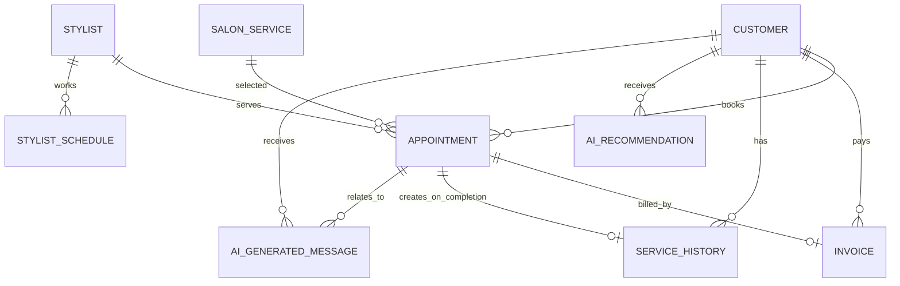

# Hệ thống quản lý Salon tích hợp AI

Ứng dụng web quản lý đặt lịch salon tóc tích hợp AI, xây dựng với ASP.NET Core MVC. Đây là đồ án môn học có dữ liệu mẫu, phân quyền Identity, kiểm tra chồng lịch thợ, hóa đơn/thanh toán, trang tổng quan/báo cáo và các trợ lý AI phục vụ demo.

## Công nghệ

- .NET 8, ASP.NET Core MVC, Razor Views, Bootstrap 5 và JavaScript/AJAX nhỏ.
- Entity Framework Core Code First, SQL Server / LocalDB.
- ASP.NET Core Identity với role `Admin`, `Receptionist`, `Stylist`.
- xUnit + EF Core InMemory cho unit test.

## Kiến trúc

`SalonManagement/` là web project; `SalonManagement.Tests/` là test project. Các thư mục chính gồm `Controllers`, `Models`, `Data`, `Services`, `ViewModels`, `Views`, `wwwroot` và `Data/Migrations`.



Các quan hệ lịch hẹn, hóa đơn và lịch sử dùng khóa ngoại hạn chế xóa để không làm orphan dữ liệu. Chỉ dữ liệu AI được cascade theo khách; liên kết lịch hẹn của tin nhắn được đặt `SetNull`.

## Chức năng

- CRUD khách hàng, thợ, dịch vụ, ca làm việc, lịch hẹn và hóa đơn.
- Tìm khách theo tên/điện thoại/email; lọc lịch hẹn theo ngày, thợ, khách, trạng thái; lọc dịch vụ theo tên/trạng thái.
- Kiểm tra ngày quá khứ, ca làm, thợ đang hoạt động, dịch vụ đang cung cấp và khoảng thời gian trùng lịch. Giờ kết thúc được tính tự động theo thời lượng dịch vụ.
- Đổi/hủy/hoàn thành lịch hẹn; khi hoàn thành tự thêm `ServiceHistory`.
- Hóa đơn chỉ lập từ lịch hoàn thành và tổng tiền lấy từ giá dịch vụ; hỗ trợ tiền mặt, chuyển khoản, thẻ.
- Dashboard, doanh thu, dịch vụ phổ biến và khách quay lại.
- AI gợi ý dịch vụ, tin nhắn nhắc/chăm sóc và tóm tắt lịch sử. Khi chưa có API key, ứng dụng dùng fallback an toàn dựa duy nhất trên dữ liệu database để demo.

## Cài đặt và chạy

1. Cài .NET SDK 8 (hoặc mới hơn) và SQL Server LocalDB / SQL Server.
2. Mở terminal tại thư mục này, khôi phục package và áp dụng migration:

   ```powershell
   dotnet restore
   dotnet ef database update --project SalonManagement --startup-project SalonManagement
   dotnet run --project SalonManagement
   ```

3. Chuỗi kết nối mặc định nằm trong `SalonManagement/appsettings.json` và dùng LocalDB. Với SQL Server khác, thay `ConnectionStrings__DefaultConnection` qua User Secrets hoặc biến môi trường, ví dụ:

   ```powershell
   dotnet user-secrets set "ConnectionStrings:DefaultConnection" "Server=localhost;Database=SalonManagement;Trusted_Connection=True;TrustServerCertificate=True" --project SalonManagement
   ```

### Migration

Migration đã được tạo tại `SalonManagement/Data/Migrations`.

```powershell
dotnet ef migrations add TenMigration --project SalonManagement --startup-project SalonManagement
dotnet ef database update --project SalonManagement --startup-project SalonManagement
```

Nếu chưa có CLI: `dotnet tool install --global dotnet-ef --version 8.0.20`.

## Tài khoản demo

Khi chạy môi trường `Development`, dữ liệu mẫu tự được seed: 10 khách, 3 thợ, 8 dịch vụ, 15 lịch, hóa đơn, lịch sử và ca làm việc. Các tài khoản có mật khẩu demo `Salon@123`:

| Vai trò | Username |
|---|---|
| Admin | `admin@salon.local` |
| Receptionist | `receptionist@salon.local` |
| Stylist | `stylist1@salon.local`, `stylist2@salon.local` |

Mật khẩu demo chỉ nằm trong `appsettings.Development.json`. Với môi trường khác, đặt `DemoAccounts__Password` bằng secret/biến môi trường trước lần đầu chạy; không đưa mật khẩu thật vào source control.

## Cấu hình AI

Mặc định `AI:Provider` là `LocalFallback`, không gọi mạng và vẫn cho demo nhất quán. Để dùng OpenAI Responses API, đặt các secret sau (không đặt API key trong `appsettings.json`):

```powershell
dotnet user-secrets set "AI:Provider" "OpenAI" --project SalonManagement
dotnet user-secrets set "AI:ApiKey" "<your-api-key>" --project SalonManagement
dotnet user-secrets set "AI:Model" "<your-model>" --project SalonManagement
```

`AIService` là implementation của `IAIService`; controller không gọi API trực tiếp. Lỗi timeout, HTTP lỗi, JSON rỗng hoặc exception được log bằng `ILogger` và chuyển sang fallback / thông báo thân thiện. Gợi ý chỉ nhận danh sách `SalonService` đang tồn tại và đang cung cấp.

Prompt được tách khỏi mã nguồn tại `SalonManagement/Prompts/SalonPrompts.json`, gồm System Prompt và các User Prompt cho gợi ý dịch vụ, tin nhắn, tóm tắt. Tài liệu KT3 gồm: `docs/KT3-Toi-uu-prompt.md`, `docs/KT3-Review-code-bang-AI.md`, `docs/Test-cases-KT3-AI.md`, `docs/KT3-Huong-dan-minh-chung-AI.md` và ảnh minh chứng tại `docs/minh-chung-kt3`.

### Gemini API Free Tier

`AIService` cũng hỗ trợ Gemini API. Tạo API Key trong Google AI Studio rồi đặt bằng User Secrets, không commit key vào GitHub:

```powershell
dotnet user-secrets set "AI:Provider" "Gemini" --project SalonManagement
dotnet user-secrets set "AI:ApiKey" "GEMINI_API_KEY_CUA_BAN" --project SalonManagement
dotnet user-secrets set "AI:Model" "gemini-3.1-flash-lite" --project SalonManagement
```

Khi Gemini lỗi, hết quota hoặc không cấu hình key, hệ thống tự dùng Local Fallback để đảm bảo demo không bị gián đoạn.

## Chạy test

```powershell
dotnet test SalonManagement.Tests/SalonManagement.Tests.csproj
```

18 test hiện có bao phủ: đặt lịch hợp lệ và tính giờ kết thúc, trùng lịch, ngoài ca, quá khứ, kiểm tra ca/thợ, tính hóa đơn và từ chối lịch chưa hoàn thành; AI mock cho phản hồi hợp lệ/rỗng/exception, retry Gemini khi HTTP 503, ba phiên bản prompt V1/V2/V3, tư vấn dịch vụ theo dữ liệu salon và trang quản lý người dùng hiển thị đúng vai trò. Test case AI thủ công nằm tại `docs/Test-cases-KT3-AI.md`; test case quản lý nằm tại `docs/Test-cases-KT2.md`.

## Demo flow

1. Đăng nhập Admin, mở Dashboard và danh sách khách.
2. Mở chi tiết một khách, xem lịch sử, dùng AI gợi ý/tóm tắt/tin nhắn.
3. Đặt lịch ở một ca hợp lệ; thử chọn giờ trùng để xem thông báo chặn.
4. Mở lịch, hoàn thành và nhập ghi chú sau dịch vụ.
5. Lập hóa đơn, xác nhận thanh toán, quay lại xem lịch sử khách.
6. Mở Báo cáo để xem doanh thu, top dịch vụ và khách quay lại.
