# Bộ mã PlantUML cho 12 Use Case

## Bảng đặc tả tóm tắt

| UC | Tác nhân | Điều kiện trước | Kết quả |
|---|---|---|---|
| UC01 Đăng nhập, đăng xuất, phân quyền | Admin, Lễ tân, Thợ | Có tài khoản | Đúng vai trò hoặc báo lỗi |
| UC02 Tài khoản cá nhân | Admin, Lễ tân, Thợ | Đã đăng nhập | Mật khẩu được đổi |
| UC03 Người dùng và vai trò | Admin | Đã đăng nhập Admin | Tài khoản/role được cập nhật |
| UC04 Khách hàng | Admin, Lễ tân | Đã đăng nhập | Hồ sơ khách được cập nhật |
| UC05 Thợ làm tóc | Admin | Đã đăng nhập Admin | Danh sách thợ được cập nhật |
| UC06 Dịch vụ salon | Admin | Đã đăng nhập Admin | Dịch vụ được cập nhật |
| UC07 Ca làm việc | Admin | Có thợ | Ca làm hợp lệ được lưu |
| UC08 Lịch hẹn | Admin, Lễ tân, Thợ | Có khách, thợ, dịch vụ | Lịch hợp lệ/trạng thái cập nhật |
| UC09 Hóa đơn, thanh toán | Admin, Lễ tân | Lịch đã hoàn thành | Hóa đơn/thanh toán được lưu |
| UC10 Dashboard | Admin | Đã đăng nhập | Hiển thị số liệu tổng quan |
| UC11 Báo cáo | Admin | Đã đăng nhập | Hiển thị báo cáo theo thời gian |
| UC12 AI hỗ trợ | Admin, Lễ tân, Thợ | Có khách hàng | Hiển thị kết quả AI/fallback |

## UC01 Đăng nhập đăng xuất và phân quyền

### Sơ đồ tuần tự
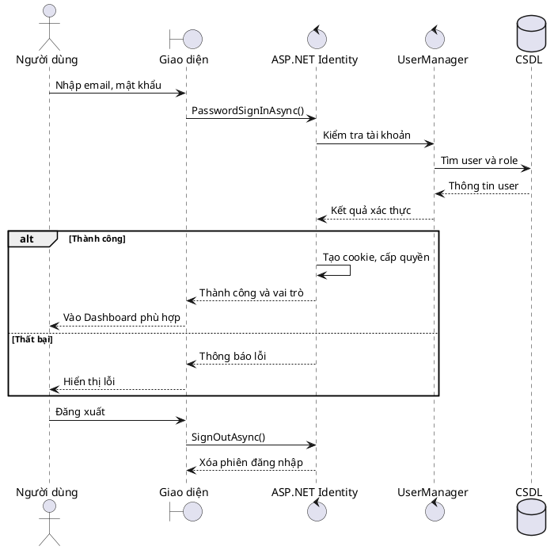

### Sơ đồ hoạt động
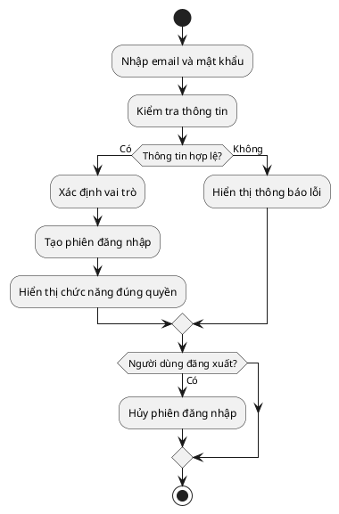

## UC02 Quản lý tài khoản cá nhân và đổi mật khẩu

### Sơ đồ tuần tự
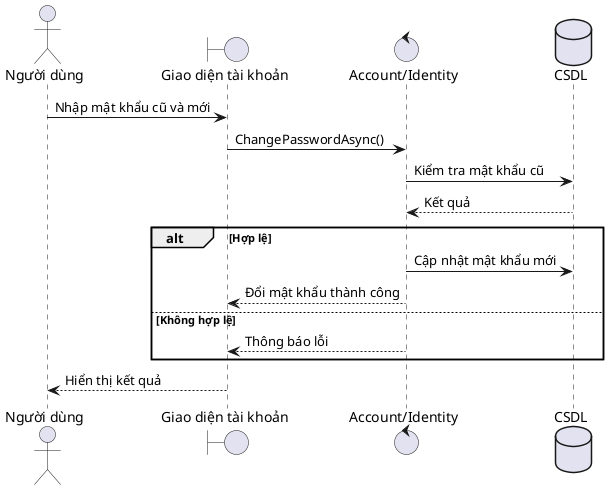

### Sơ đồ hoạt động
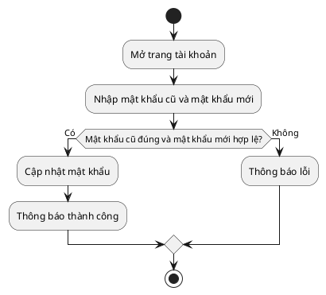

## UC03 Quản lý người dùng và vai trò

### Sơ đồ tuần tự
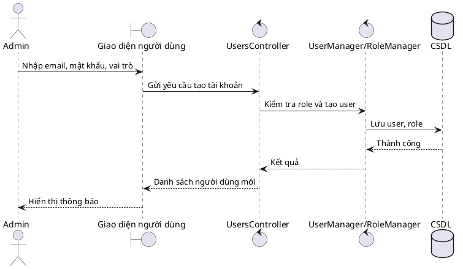

### Sơ đồ hoạt động
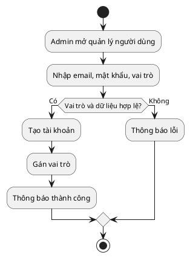

## UC04 Quản lý khách hàng

### Sơ đồ tuần tự
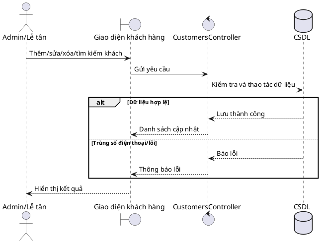

### Sơ đồ hoạt động
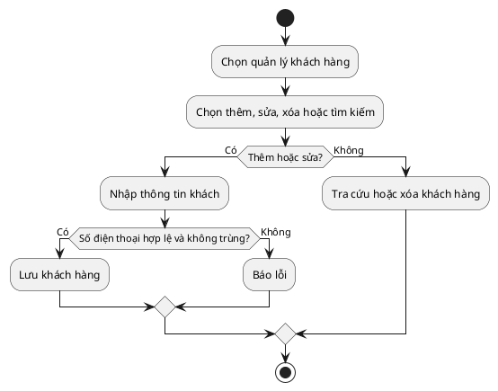

## UC05 Quản lý thợ làm tóc

### Sơ đồ tuần tự
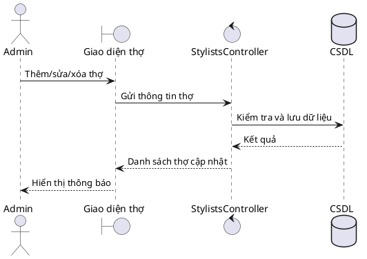

### Sơ đồ hoạt động
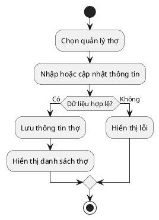

## UC06 Quản lý dịch vụ salon

### Sơ đồ tuần tự
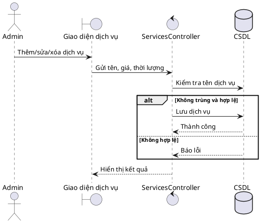

### Sơ đồ hoạt động
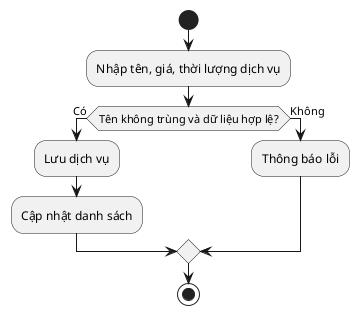

## UC07 Quản lý ca làm việc

### Sơ đồ tuần tự
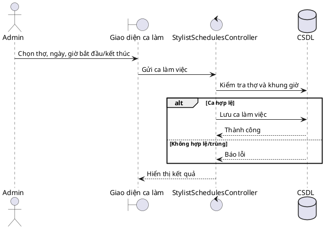

### Sơ đồ hoạt động
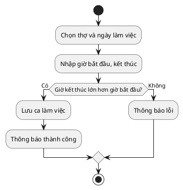

## UC08 Quản lý lịch hẹn

### Sơ đồ tuần tự
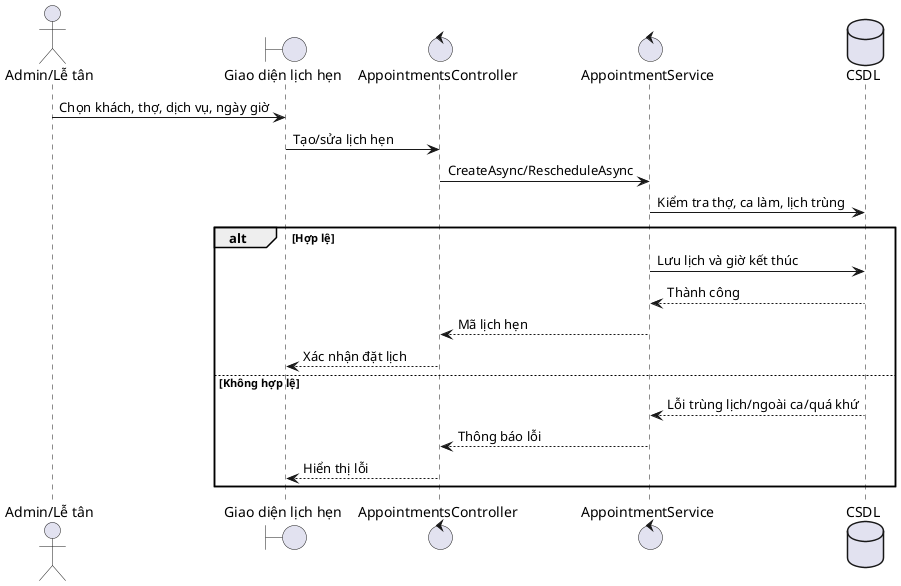

### Sơ đồ hoạt động
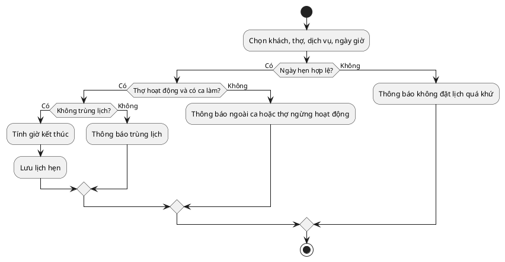

## UC09 Quản lý hóa đơn và thanh toán

### Sơ đồ tuần tự
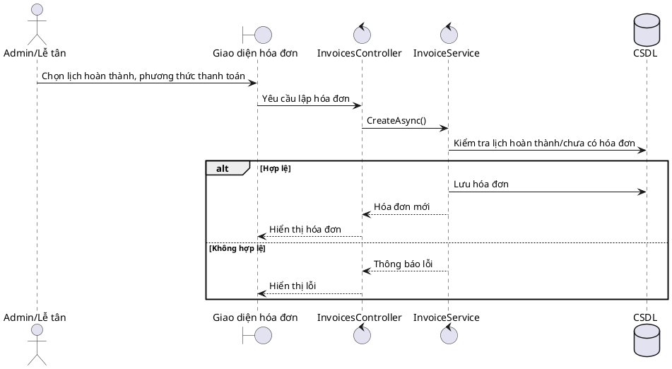

### Sơ đồ hoạt động
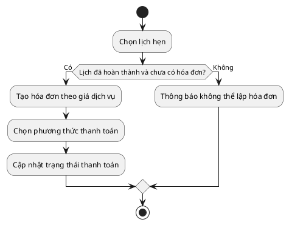

## UC10 Dashboard tổng quan

### Sơ đồ tuần tự
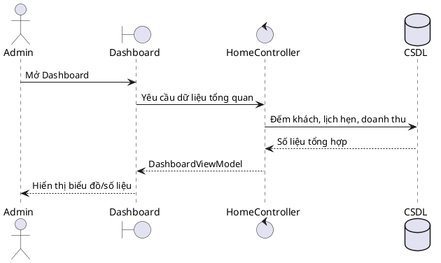

### Sơ đồ hoạt động
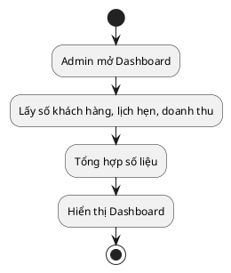

## UC11 Báo cáo

### Sơ đồ tuần tự
```plantuml
@startuml
actor Admin
boundary "Giao diện báo cáo" as V
control "ReportsController" as C
database CSDL as DB
Admin -> V: Chọn khoảng thời gian
V -> C: Yêu cầu báo cáo
C -> DB: Truy vấn hóa đơn đã thanh toán
C -> DB: Thống kê dịch vụ và khách quay lại
DB --> C: Dữ liệu báo cáo
C --> V: ReportViewModel
V --> Admin: Hiển thị báo cáo
@enduml
```

### Sơ đồ hoạt động
```plantuml
@startuml
start
:Chọn ngày bắt đầu và ngày kết thúc;
if (Khoảng thời gian hợp lệ?) then (Có)
 :Tính doanh thu;
 :Thống kê dịch vụ phổ biến;
 :Thống kê khách quay lại;
 :Hiển thị báo cáo;
else (Không)
 :Đổi lại thứ tự ngày;
endif
stop
@enduml
```

## UC12 AI gợi ý dịch vụ sinh tin nhắn tóm tắt lịch sử

### Sơ đồ tuần tự
```plantuml
@startuml
actor "Người dùng" as U
boundary "Giao diện AI" as V
control "AIController" as C
control "AIService" as A
database CSDL as DB
U -> V: Chọn khách và chức năng AI
V -> C: Gửi yêu cầu AI
C -> DB: Lấy khách, lịch sử, dịch vụ
DB --> C: Dữ liệu cần thiết
C -> A: Recommend/Message/Summarize
alt AI phản hồi thành công
 A --> C: Nội dung AI
 C -> DB: Lưu gợi ý/tin nhắn khi cần
 C --> V: Hiển thị kết quả
else AI lỗi/chưa có API Key
 A --> C: Lỗi hoặc Local Fallback
 C --> V: Thông báo hoặc kết quả fallback
end
@enduml
```

### Sơ đồ hoạt động
```plantuml
@startuml
start
:Chọn khách hàng và chức năng AI;
:Lấy dữ liệu cần thiết;
if (Dữ liệu hợp lệ?) then (Có)
 :Gọi AI Service;
 if (AI trả kết quả?) then (Có)
  :Hiển thị kết quả AI;
 else (Không)
  :Dùng Local Fallback hoặc thông báo lỗi;
 endif
else (Không)
 :Thông báo không tìm thấy khách hàng;
endif
stop
@enduml
```
